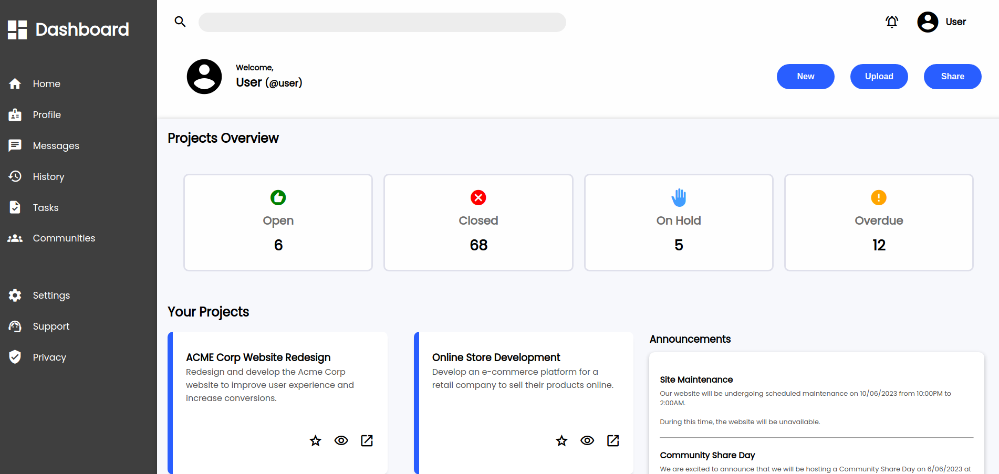

# Admin Dashboard

🔗 [View Demo](https://eternum101.github.io/admin-dashboard/)

## Table of Contents
- [About The Project](#about-the-project)
- [Built With](#built-with)
- [Screenshots](#screenshots)
- [Features](#features)

## About The Project
A Modern Design of an Admin Dashboard primarily showcasing the use of CSS Grid.

## Screenshots

### Initial Screen

[Back to Top](#admin-dashboard)

## Built With

[Back to Top](#admin-dashboard)

## Features

- Primary Use of CSS Grid & Flexbox
- Friendly User Interface
- Projects Overview, Your Projects, Announcements & Trending Sections

[Back to Top](#admin-dashboard)

